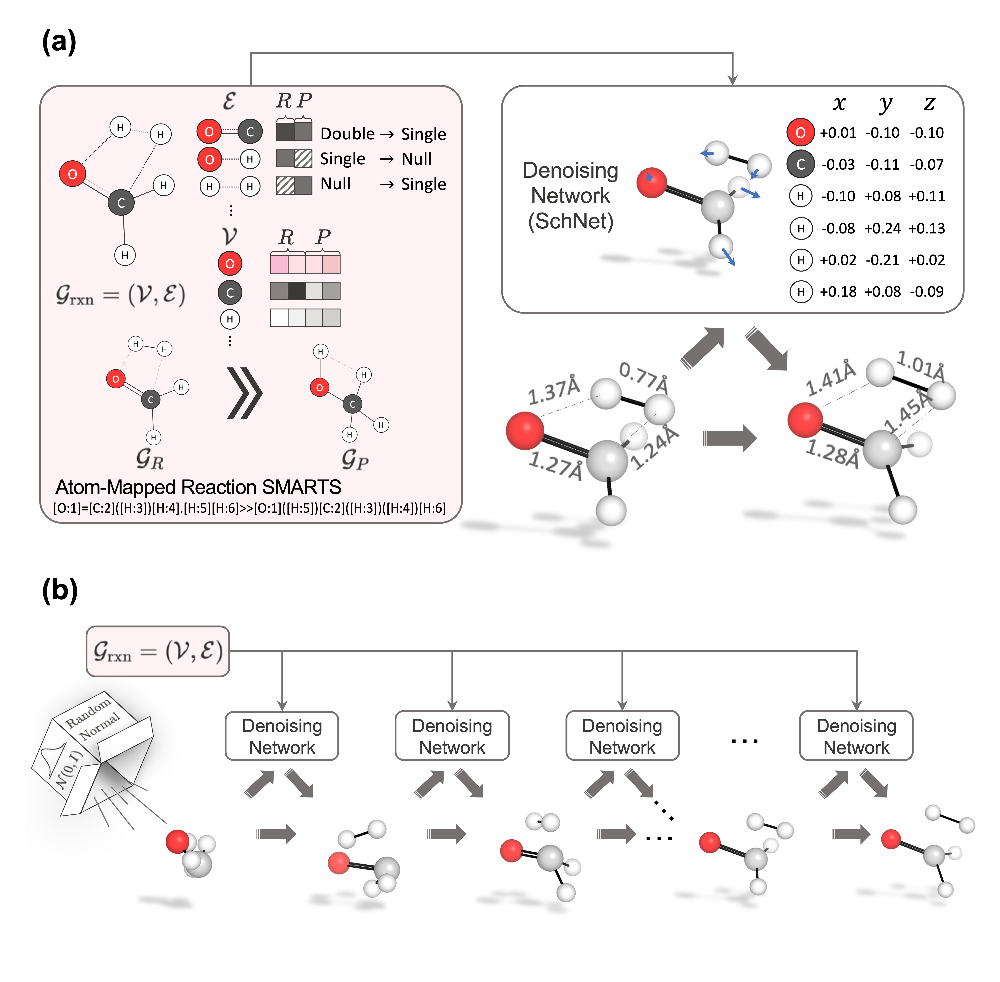
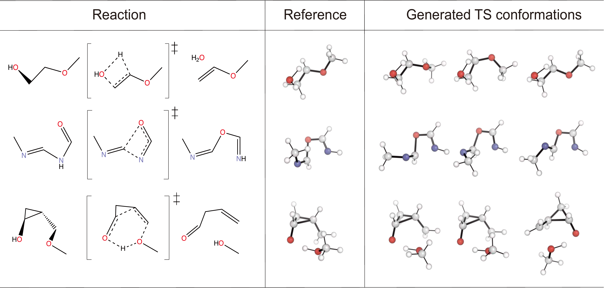
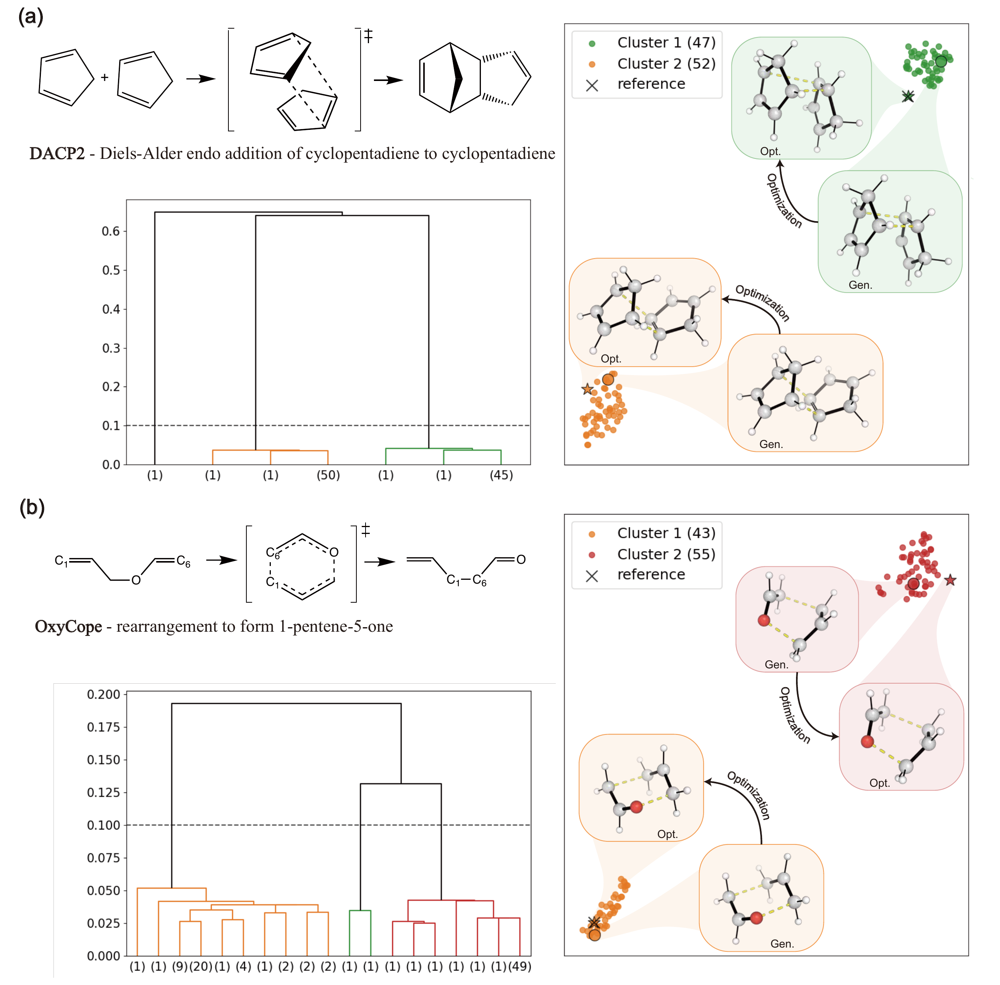

# TSDiff : Diffusion-based Generative AI for Exploring Transition States from 2D Molecular Graphs

[](https://github.com/seonghann/tsdiff/tree/master/LICENSE)

The official implementation of TSDiff: Diffusion-based Generative AI for Exploring Transition States from 2D Molecular Graphs [[arxiv]](https://arxiv.org/abs/2304.12233).


## Environments

### Install via Conda (Recommended)

```bash
# Clone the environment
conda env create -f env.yml
# Activate the environment
conda activate cu102_tsdiff
# Install PyG
conda install pytorch-geometric=1.7.2=py37_torch_1.8.0_cu102 -c rusty1s -c conda-forge
```

## Dataset

### Offical Dataset
The training and test dataset is from the open-source transition state database of Grambow, Colin A. et al. [[zenodo]](https://zenodo.org/record/3715478) [[paper]](https://www.nature.com/articles/s41597-020-0460-4).

### Preprocessed dataset
We provide the datasets used in the paper, which is computed with $\omega\text{b97x-D3}$ level.
To reproduce paper you can follow the code.
```bash
PARENT_DIR=$(dirname $(pwd))
export PYTHONPATH="$PARENT_DIR:${PYTHONPATH}"
python3 preprocessing.py
ls data/TS/wb97xd3/random_split_42
```

### Reproducibility
[](https://doi.org/10.5281/zenodo.10224071)

All source data to reproduce the key results of the paper can be found on Zeonodo. The data includes TS geometries generated by TSDiff and logs of successive DFT computations. By running “reproduce.sh” file in the data, all results can be reproduced.


```bash
mkdir reproducibility
# mv *.tar.gz file to ./reproducibility
mv reproduce.sh ./reproducibility
cd reproducibility
tar -xvzf IRC_calculation.tar.gz
tar -xvzf optimized.tar.gz
tar -xvzf generated.tar.gz
tar -xvfz reference.tar.gz
sh reproduce.sh
```


## Training

All hyper-parameters and training details are provided in config files (`./configs/*.yml`), and free feel to tune these parameters.

You can train the model with the following commands:

```bash
# Default settings
python train.py ./config/train_config.yml
```

The model checkpoints, configuration yaml file as well as training log will be saved into a directory specified by `--logdir` in `train.py`.

## Sampling

We provide the checkpoints of eight trained models, trained with the $\omega\text{b97x-D3}$ data. Each of them are same except for the initial model weight (initial seed). Note that, please put the checkpoints `*.pt` into paths like `${log}/${model}/checkpoints/`, and also put corresponding configuration file `*.yml` into the upper level directory `${log}/${model}/`.

You can reproduce results of the paper by:

```bash
CKPTS="logs/trained_ckpt/ens0/checkpoints/best_ckpt.pt logs/trained_ckpt/ens1/checkpoints/best_ckpt.pt logs/trained_ckpt/ens2/checkpoints/best_ckpt.pt logs/trained_ckpt/ens3/checkpoints/best_ckpt.pt logs/trained_ckpt/ens4/checkpoints/best_ckpt.pt logs/trained_ckpt/ens5/checkpoints/best_ckpt.pt logs/trained_ckpt/ens6/checkpoints/best_ckpt.pt logs/trained_ckpt/ens7/checkpoints/best_ckpt.pt"
python sampling.py \
    $CKPTS \
    --start_idx 0 --end_idx 9999 --sampling_type ld \
    --save_dir reproduce/wb97xd3 --batch_size 100 \
    --test_set data/TS/wb97xd3/random_split_42/test_data.pkl
```
Here `start_idx` and `end_idx` indicate the range of the test set that we want to use. All hyper-parameters related to sampling can be set in `sampling.py` files. 

Examples of generated TS conformers by TSDiff are provided below.

<p align="center">
   
</p>

## Clustering

After sampling TS candidates, you can cluster it by their geometric features. We provide `clustering.py` for the higherarchy clustering. In Fig S1. of the paper, we used the clustering code to exploring TS conformers of organic reactions in Birkholz and Schlegel's benchmark set. The benchmark reactions are in `birkholz_benchmark`.
To reproduce it, follows below:
```bash
for ((i=0; i<N; i++));
do python3 sampling.py $CKPTS --start_idx $i --end_idx $((i+1)) --test_set birkholz_benchmark/selected_rxns.txt --save_dir birkholz_benchmark/rxn_${i}
python3 clustering.py --save_dir birkholz_benchmark/rxn_${i}/clustering --sample_path birkholz_benchmark/rxn_${i}/samples_all.pkl
done
```
<p align="center">
   
</p>


## Citation
Please consider citing the our paper if you find it helpful. Thank you!
```
@article{kim2023diffusion,
  title={Diffusion-based Generative AI for Exploring Transition States from 2D Molecular Graphs},
  author={Kim, Seonghwan and Woo, Jeheon and Kim, Woo Youn},
  year={2023}
}
```

## Acknowledgement
This work is built upon Geodiff : [[arXiv](https://arxiv.org/abs/2203.02923)], [[github](https://github.com/MinkaiXu/GeoDiff)]. Thanks Minkai Xu.

## Contact
If you have any question, please contact me at dmdtka00@kaist.ac.kr.
